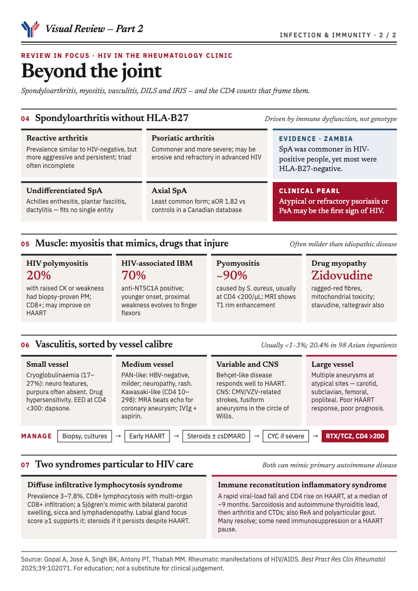

> **TL;DR:** In a person with HIV, joint, muscle or vessel inflammation can be the virus itself, an opportunistic infection, a drug effect, an immune-reconstitution reaction or a coincident autoimmune disease — and treatment choices turn on CD4 count and viral control.

HIV is an easy diagnosis to leave out of a rheumatology differential, because the presentations borrow so freely from rheumatoid arthritis, spondyloarthritis, polymyositis, Sjögren's syndrome and the vasculitides. This review from JIPMER in India sorts them by mechanism and tissue, and ends with a management frame built around two numbers: the CD4 count and the viral load. The evidence behind that frame is thin, and the paper says so. The graphic above is part 1 of a two-part visual summary, covering the joint syndromes, the routes from virus to disease and the treatment ladder; part 2, covering spondyloarthritis, muscle, vasculitis, DILS and IRIS, follows further down.

## Why this belongs in the rheumatology clinic

Rheumatic and musculoskeletal disorders in HIV arise from the virus's direct effects, from immune dysregulation, from opportunistic infection, from drug toxicity, and from pre-existing autoimmune disease made worse by immune dysfunction. They can occur at any stage and can precede the HIV diagnosis, often with atypical features.

The prevalence figures are high but vary by cohort. An Indian study reported musculoskeletal disorders in **63.3%** of HIV-positive people, an Ethiopian cohort found musculoskeletal complaints in **48%**, and a UK cohort on antiretroviral therapy reported multisite pain in **63%**, with the foot and ankle most affected. In the UK cohort, older age, longer time since diagnosis and current protease inhibitor use were associated with pain, and the introduction of HAART did not reduce the incidence of musculoskeletal pain.

Earlier cohort studies from the 1990s found that immune-mediated connective tissue disease occurred at about the same frequency in people with HIV as in the general population. A more recent Taiwanese national database analysis found higher rates of Sjögren's syndrome, psoriasis and autoimmune haemolytic anaemia in people with HIV than in matched controls.

## Four joint syndromes that are easy to confuse

**Arthralgia** is among the most common manifestations. It can be part of the seroconversion illness and is typically polyarticular, intermittent and self-limiting. Reported prevalence varies widely, from 4.5% of cases in a Spanish cohort of 556 patients to 45% in a Mexican cohort. It does not progress to frank arthritis, and symptomatic treatment is usually enough.

**HIV-associated arthritis** is less common. The usual pattern is an asymmetric oligoarthritis of large lower-limb joints, the knees and ankles, with a male predominance. A symmetrical polyarticular form can closely resemble RA clinically and, to a degree, on imaging, though erosions are uncommon. It typically resolves within **6–8 weeks** and rarely leaves deformity. Synovial fluid is inflammatory but sterile on culture, and RF and ACPA are typically absent. Direct viral involvement is proposed: HIV p24 antigen has been found in synovial lining cells and mononuclear cells, HIV RNA and tubuloreticular inclusions in synovial fluid. NSAIDs and intra-articular corticosteroids are first-line, and hydroxychloroquine and sulfasalazine have been reported to help.

**Painful articular syndrome** is a distinct, self-limiting disorder: sudden severe pain in bones and adjacent joints, usually lasting **under 24 hours**, mostly in the lower limbs but sometimes the shoulders and elbows. It is described mainly in advanced HIV, there is no synovitis, and the pain is often severe enough to need hospital admission and narcotic analgesia. An Indian cohort documented it in about **10%** of HIV-infected people. It is unclear whether it has declined in the HAART era.

**Rheumatoid arthritis** and HIV can coexist, and the relationship runs both ways. CD4+ T-cell depletion may lead RA to remit, whereas RA can arise de novo after HAART is started, as part of immune reconstitution. Features that separate RA from HIV-associated arthritis are an insidious rather than acute onset, a symmetric polyarthritis, common moderate-to-high-titre RF and ACPA, and erosions on plain films. The diagnostic trap is that HIV can cause false-positive RF and ACPA results, though usually at low titre.

## Spondyloarthritis without the HLA-B27 link

The spondyloarthritis story in HIV is unusual because it does not follow the genotype. Ankylosing spondylitis is among the least common manifestations. In a Taiwanese analysis it was the least commonly diagnosed autoimmune disease in people with HIV, though a Canadian insurance database of 4,200 HIV-positive people against 16,000 controls found it more often in the HIV group, with an **adjusted OR of 1.82**. The clinical course of AS in HIV appears independent of HIV progression, and most data are isolated case reports.

In Africa, where HLA-B27 is rare, the HIV epidemic changed the epidemiology: reactive arthritis and psoriatic arthritis became notably more common. A Zambian study found a higher frequency of spondyloarthritis in HIV-positive than HIV-negative people, with reactive, undifferentiated and psoriatic forms predominating, and **HLA-B27 absent in most cases tested** — suggesting the increase tracks HIV itself, not the allele. An Indian cohort of 75 HIV-positive patients found spondyloarthritis features in 8%, and rheumatic symptoms tended to improve after antiretroviral therapy began.

**Reactive arthritis.** Early series reported it as a very common arthritis in HIV: one described 13 patients with severe Reiter's syndrome, nine of whom (69%) were HLA-B27 positive, and another found 10 cases among 72 HIV-positive patients with rheumatic symptoms. Later cohort studies found the prevalence to be similar to that in HIV-negative people, but the course is more aggressive and persistent. The triad is often incomplete, the arthritis is usually an asymmetric lower-limb oligoarthritis or polyarthritis, and mucocutaneous features, especially extensive keratoderma blennorrhagicum, can look like psoriatic arthritis. The proposed mechanism differs from the classical one: an unidentified antigen presented through HLA-B27 to CD8+ T cells, with HIV itself acting as a persistent immunological stimulus in susceptible hosts, and CD4 depletion and altered cytokine profiles making the disease worse.

**Psoriatic arthritis.** People with HIV are at increased risk of psoriasis and PsA, often with more severe disease. Cutaneous patterns include persistent guttate, plaque, inverse and erythrodermic psoriasis, and arthritis may be severe, erosive and resistant to standard therapy in advanced HIV. The review gives a practical flag: **atypical forms of psoriasis, severe refractory psoriasis, and PsA unresponsive to conventional treatment may be the first clinical sign of underlying HIV.**

**Undifferentiated spondyloarthritis.** Enthesitis involving the Achilles, ankle pain, dactylitis, plantar fasciitis and shoulder pain are common and often fit no single named entity. The authors note that tendinitis and chronic tendinopathy in this group are often related to repetitive mechanical trauma on top of inflammation.

## A diagnostic route for joint pain

The paper's flowchart applies ordinary rheumatological logic with HIV-specific adjustments. It starts by separating arthralgia (no synovitis on examination) from arthritis, then uses duration and joint pattern.

- **Arthralgia only.** Think HIV-related arthralgia or the seroconversion illness. If there is acute, intense pain in adjacent bone, consider painful articular syndrome and treat symptomatically with NSAIDs or acetaminophen.
- **Acute arthritis, under six weeks.** For a single joint, rule out septic arthritis, septic bursitis and crystal arthritis; if those are excluded, HIV-associated arthritis is likely. For an oligoarthritis, examine skin, eyes, nails and entheses and clinically exclude reactive arthritis, PsA and RA before settling on HIV-associated arthritis. For a polyarthritis, a thorough examination for systemic rheumatic causes is needed, with viral arthritides and malignancy on the differential alongside HIV-associated arthritis.
- **Chronic arthritis, over six weeks.** A single joint calls for synovial fluid analysis, with tuberculosis, other infection and avascular necrosis in mind. An oligoarthritis suggests the spondyloarthritis spectrum: look for enthesitis, uveitis, psoriasis and inflammatory back pain, and consider HLA-B27. A polyarthritis suggests RA or another autoimmune disease: test RF, ACPA and ANA, and **interpret ANA cautiously, because HIV-positive people may carry multiple autoantibodies.** HIV-associated arthritis is less likely to be chronic.

## Managing inflammatory arthritis in HIV

The central tension is that immunosuppression might worsen HIV or invite opportunistic infection, while the evidence on safety comes mainly from case reports and small series. The authors' management principles, set out in their Box 1, run in escalating steps:

1. **First line:** NSAIDs for symptoms and intra-articular corticosteroids for localised inflammation. Indomethacin may carry an extra benefit from intrinsic antiviral properties.
2. **Safer conventional DMARDs:** hydroxychloroquine, preferred for its additional antiviral activity, and sulfasalazine, which has been used in spondyloarthritis without negative effect on HIV progression.
3. **Escalation:** methotrexate and leflunomide, used only when CD4 count is above **200/µL** and viral load is controlled, with mandatory monitoring of blood counts and liver function. Methotrexate appears safe with adequate CD4 counts and low viral load. Leflunomide may offer an added advantage, since it has shown potential to reduce HIV viral load.
4. **Biologic DMARDs for refractory disease:** TNF inhibitors (etanercept, adalimumab, infliximab), used cautiously in stable HIV with close watch for opportunistic infection. A systematic review found 37 treatment episodes involving six biologic agents across ten inflammatory conditions. Biologics appear effective and well tolerated, with infectious complications comparable to HIV-negative patients and no adverse effect on HIV control, even among those not on ART at the time. There is also a case report of secukinumab achieving remission of axial SpA with HIV without complications; the drug's safety in HIV remains uncertain because such patients are excluded from trials.
5. **Underlying everything, optimise HAART.** Arthritis due to SpA may improve substantially once HAART begins or is optimised.

Short courses of corticosteroids have been used safely; meta-analyses of short-course steroids in tuberculosis showed no major excess of adverse events. For follow-up, the paper advises clinical review every 4–8 weeks initially, with regular CD4 count, HIV viral load, blood count and liver function, **Pneumocystis prophylaxis when CD4 falls below 200/µL**, and immediate management of septic arthritis, pyomyositis and deep tissue infection, with surgery if needed for drainage or vascular compromise. The long-term effects of biologics on opportunistic infection, malignancy and HIV control remain to be studied.

## HAART, and the new problem of immune reconstitution

Before HAART, rheumatic disease in HIV appeared in the late, immunosuppressed stages and included reactive arthritis, PsA and painful articular syndrome; RA and SLE were rare, which fits CD4 depletion. In the HAART era, the prevalence of manifestations tied to HIV itself has fallen, but a group of autoimmune rheumatic disorders linked to immune reconstitution has emerged.

**IRIS** follows a rapid fall in viral load and a steep rise in CD4 count after HAART. The restoring immune system can reactivate latent opportunistic infections, aggravate existing ones, and unmask new autoimmune disease or worsen existing disease. A review of 32 cases of rheumatic manifestations linked to IRIS found sarcoidosis and autoimmune thyroiditis most common, followed by arthritis and other connective tissue diseases, appearing at a **median of about nine months** after HAART began. Reactive arthritis and polyarticular gout have also been reported. Many cases resolve on their own, though some are severe enough to need immunosuppression or a temporary pause in HAART.

## Musculoskeletal infections

Soft tissue, muscle, joint and bursal infections are an important group, and non-infectious problems such as lipodystrophy also occur.

- **Cellulitis and abscesses** are mostly caused by MRSA. Incidence has declined in some populations but remains clinically significant and probably under-reported. They are more frequent in younger HIV-positive people, and risk rises with low CD4 count and high viral load. CT is better than examination alone for deep abscesses or underlying osteomyelitis.
- **Septic arthritis** presents and is caused much as in HIV-negative people, with overall prevalence comparable or even lower. *Staphylococcus aureus* accounts for roughly **50–66%** of cases, followed by *Streptococcus pneumoniae*. It typically occurs when CD4 falls below 200, and a case series found seven of nine with musculoskeletal sepsis had CD4 counts below 100. Mycobacterial and fungal joint infections occur in advanced disease.
- **Septic bursitis** most often involves the olecranon, prepatellar and subdeltoid bursae, often after local trauma and in people with diabetes, malnutrition or corticosteroid use. Management combines surgical drainage with targeted antimicrobials.

## Muscle disease

The second half of the visual summary is below, as a recap of the spondyloarthritis, muscle, vasculitis, DILS and IRIS sections. Tap it to open it full size.





HIV can cause generalised weakness through chronic inflammation and cachexia, and a range of specific muscle disorders. These include HIV-associated polymyositis, inclusion body myositis, nemaline myopathy, wasting syndrome, drug-induced myopathy, opportunistic muscle infection and lymphoma.

**HIV-associated polymyositis** can occur at any stage, as an initial manifestation or late, and its incidence has fallen in the HAART era. In a cohort of 64 HIV-positive patients with raised muscle enzymes or proximal weakness, **13 (20%)** had biopsy-proven polymyositis, at a median of 4.3 years after HIV diagnosis. Severity of enzyme elevation, weakness, HIV stage and antiretroviral use were not associated with each other. The clinical picture mirrors idiopathic polymyositis. Biopsies show endomysial, interfascicular and perivascular mononuclear infiltrates of mainly CD8+ T cells and macrophages, suggesting an MHC class I-restricted CD8+ T-cell-mediated process driven by HIV. Prognosis is generally better than for idiopathic disease, and some patients improve spontaneously. Treatment follows the idiopathic protocols, including steroids, methotrexate, mycophenolate, azathioprine, cyclophosphamide and IVIg, but immunosuppression must be used cautiously. Dermatomyositis is reported less often.

**HIV-associated inclusion body myositis** presents at a younger age and is diagnosed earlier than sporadic IBM. It may begin with proximal weakness that responds to treatment, then evolve toward the finger and wrist flexor weakness typical of IBM. In the Johns Hopkins series of 13 patients, **70%** tested positive for anti-NT5C1A antibodies, and histopathology and gene expression were similar to idiopathic IBM, with immunophenotyping showing similar numbers of PD-1+ cells but absence of KLRG1+ and CD57+ cells in the HIV group.

**Other muscle disease.** Necrotising and granulomatous myositis are described, as is inflammatory myopathy as a manifestation of IRIS, and DILS can involve muscle. Sporadic late-onset **nemaline myopathy** has been reported in a few cases, with prednisone and IVIg showing benefit in some, and the authors say its link to HIV may be coincidence. **Antiretroviral myopathy** was first linked to high-dose zidovudine: proximal weakness, raised enzymes, sometimes raised lactate, and biopsy showing ragged red fibres, with other mitochondrial toxicity such as lipodystrophy, steatosis and lactic acidosis. Stavudine has been associated with rapidly progressive weakness combining axonal neuropathy with mitochondrial myopathy. Severe muscle wasting is common in advanced HIV and multifactorial, and corticosteroid therapy has been noted to help recovery of muscle mass in some patients.

**Pyomyositis** occurs mainly in advanced HIV, typically with CD4 below 200, and *S. aureus* causes about **90%** of cases. It runs through three stages: an invasive stage of 1–3 weeks with localised pain, induration and low-grade fever; a suppurative stage with increasing pain, fever, muscle oedema and pus; and a late stage that can progress to sepsis and death if untreated. MRI shows rim enhancement on T1 and hyperintensity on T2.

## Diffuse infiltrative lymphocytosis syndrome

DILS is an uncommon multisystem disorder with estimated prevalence of **3–7.8%** in people with HIV. One study found 0.11% among women receiving HAART, 2.99% among women not receiving it and 0.17% among men regardless of HAART. It is characterised by sustained CD8+ lymphocytosis and CD8+ infiltration of multiple organs.

It usually develops in untreated or poorly controlled HIV, though it can occur independent of CD4 count. Clinically it **mimics Sjögren's syndrome**, with bilateral parotid enlargement, lymphadenopathy and sicca symptoms, plus involvement of lungs, nervous system, liver, kidneys and gut. The combination of sicca, organomegaly or organ dysfunction and polyclonal CD8+ infiltration is highly suggestive in a person with HIV, and labial salivary gland biopsy supports the diagnosis, particularly with a focus score of 1 or more. Corticosteroids may be needed if organ infiltration persists despite HAART.

## Vasculitis, sorted by vessel size

Vasculitis is relatively uncommon in HIV, with most studies reporting a prevalence under 1–3%, although one study of 98 Asian inpatients found **20.4%**. Longitudinal data suggest incidence has fallen with HAART. Proposed mechanisms include direct vascular injury from HIV replication or opportunistic pathogens, immune complex deposition, chronic immune activation, molecular mimicry and IRIS.

- **Small vessel.** Hypersensitivity vasculitis is often drug-related, with didanosine, zidovudine and dolutegravir implicated. Erythema elevatum diutinum occurs with CD4 below 300 and generally responds to dapsone. **Mixed cryoglobulinaemia** is reported in 17–27%, often with co-infections such as hepatitis C, CMV and EBV; compared with HIV-negative disease, purpura is less frequent and neurological symptoms more prominent. ANCA-associated vasculitis (GPA, EGPA, MPA) and IgA vasculitis are described.
- **Medium vessel.** A **PAN-like syndrome**, distinct from classic PAN by lacking hepatitis B association, has a mean age of 44 years, 78% male predominance and a wide CD4 range (14–540). Peripheral neuropathy and rash are more common than in classic PAN, and it is often less severe. About a third have constitutional features, and diagnosis is often delayed because histology is not routinely obtained. **Kawasaki-like syndrome** occurs with moderate to severe immunosuppression (CD4 10–298), in adults with fever of at least five days, hand and foot swelling and pain, lymphadenopathy, rash, conjunctivitis without exudate and pharyngitis, plus often gastrointestinal symptoms. Transthoracic echocardiography is insensitive for coronary aneurysm in adults, and MRA is the better test. Treatment is as for classical Kawasaki disease, IVIg and aspirin.
- **Variable vessel and CNS.** Behçet's-like disease, with oral and genital ulcers, uveitis and systemic involvement, was found in 15 of 98 HIV-positive people in one study and, unlike classic Behçet's, is linked to HIV-related immune dysregulation and **often responds to HAART**. CNS vasculitis can present as recurrent stroke, organic brain syndromes or aneurysms including fusiform aneurysms of the circle of Willis, often in advanced HIV with CMV or VZV. MRI and angiography help, and brain biopsy is the gold standard.
- **Large vessel.** Disease may be aneurysmal or occlusive; among 226 reported cases, 111 had aneurysms and 115 occlusions. In one series, 12% of 93 patients with large-vessel vasculitis were HIV-positive, mostly men, with more vascular complications, poorer response to antiretrovirals and worse outcomes than HIV-negative patients. Aneurysms occur at atypical sites such as the carotid, subclavian, femoral and popliteal arteries, with histology often showing leukocytoclastic vasculitis of the vasa vasorum, and the **prognosis is poor and aneurysmal disease does not respond to HAART**.

**Diagnosis and management.** Diagnosis is hard because of overlap with infection and other inflammatory conditions; biopsy plus microbiological cultures to exclude infectious mimics is crucial, and management should fit disease severity and vasculitis type. **Early HAART is essential** to control disease and prevent complications such as aneurysm. Corticosteroids and immunosuppressants (methotrexate, leflunomide, mycophenolate, azathioprine) are effective in most cases, cyclophosphamide may be reserved for severe disease, and refractory cases may warrant rituximab or tocilizumab, with biologics considered only when CD4 is above 200 and viral load is well controlled. Emergency surgery may be needed for symptomatic aneurysms or critical occlusion, and prophylaxis against opportunistic infection remains essential during immunosuppression.

## The authors' practice points and research agenda

The summary points are these: rheumatic disorders in HIV can occur at any stage and can be diagnosed alongside HIV; HIV-associated arthritis may mimic RA but is typically self-limited and non-erosive, and painful articular syndrome is unique to HIV; HIV polymyositis resembles idiopathic polymyositis with CD8+ T-cell-mediated inflammation, while HIV-associated IBM presents earlier than idiopathic IBM; musculoskeletal infections in advanced HIV are mainly staphylococcal and associated with low CD4; most HIV vasculitis responds to HAART, HIV-associated PAN is less severe than classical PAN, and aneurysms at atypical sites may respond poorly; and treatment is complicated by immunosuppression risk, with NSAIDs, intra-articular steroids, hydroxychloroquine and biologics usable under careful monitoring of HIV status. Most conventional synthetic DMARDs are considered safe, and biologics are advised only when viral load is low and HIV well controlled.

The research agenda names four gaps: the molecular and immunological mechanisms of HIV-associated arthritis, myositis and spondyloarthritis; the effect of specific antiretroviral classes on rheumatic and muscle complications, particularly IRIS; the safety and long-term outcomes of newer agents, including TNF and IL-17 inhibitors, in HIV-positive people; and global variation in prevalence and outcomes, particularly in resource-limited settings.

## What to hold loosely

- **The treatment evidence is thin.** The authors state that the evidence on immunomodulators in HIV comes mainly from case reports and small series, and that people with HIV are excluded from the trials of newer drugs.
- **The CD4 threshold of 200/µL is a working rule, not a trial-derived cut-off.** The paper applies it to conventional immunosuppression, to biologics in vasculitis and to Pneumocystis prophylaxis, but it does not present randomised data for it.
- **Prevalence ranges are very wide**, such as 4.5% to 45% for arthralgia, which reflects differences in cohorts and definitions as much as biology.
- **Several observations come from the pre-HAART era**, so their frequency today may be lower, as the authors note for painful articular syndrome.
- **It is a narrative review.** It does not describe a systematic search or quality appraisal, and some of its own figures differ between text and tables, for example the count of reactive arthritis cases in one series.

The practical message is a change of habit more than a new algorithm. In any patient with an unusual arthritis, myositis, refractory psoriasis, sicca picture or vasculitis, ask about HIV and check CD4 count and viral load before escalating immunosuppression, because both the diagnosis and the safety of the treatment depend on them.

*Disclosures noted in the source: the authors declare no competing interests, and no funding was received.*


